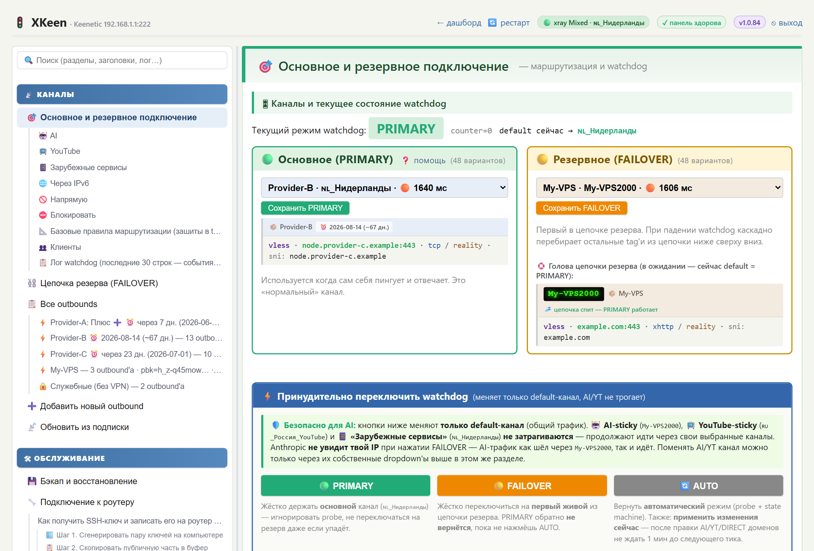
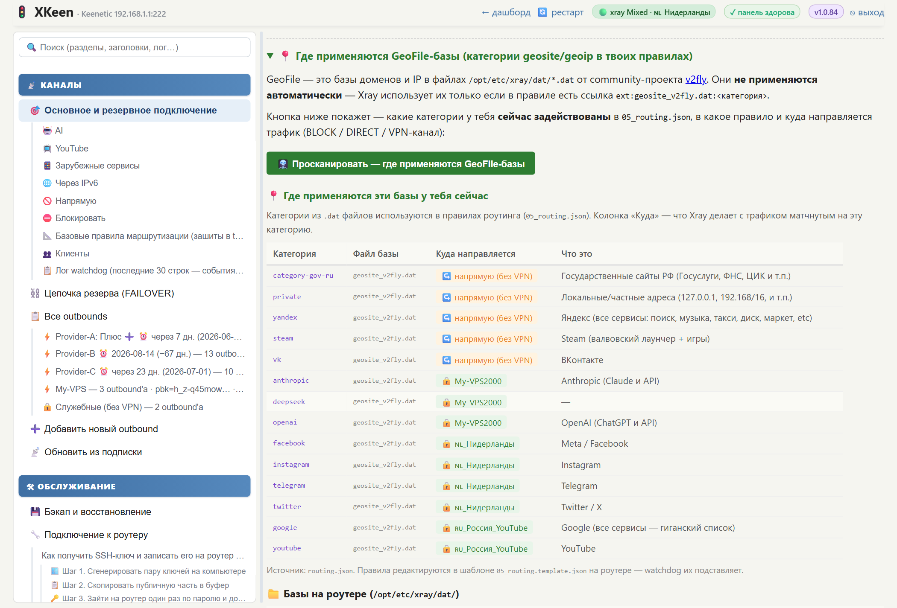
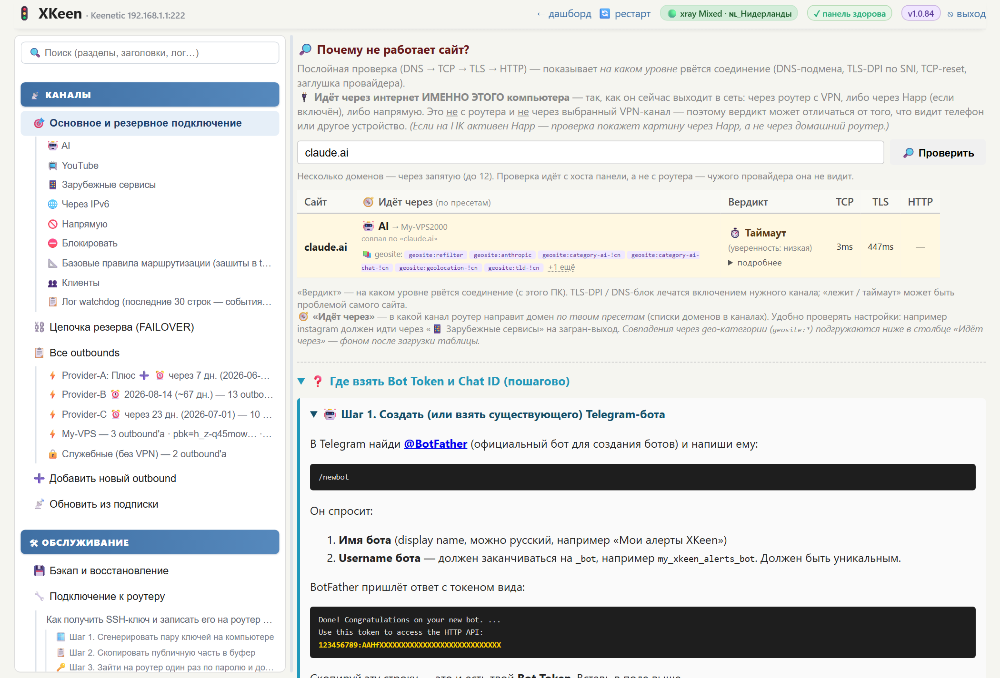
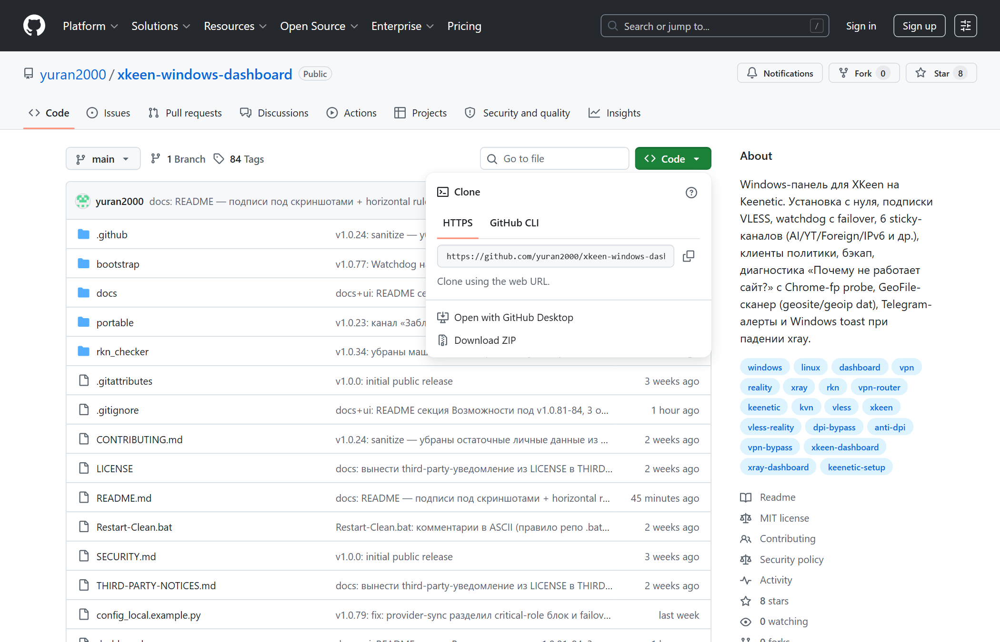

# xray-dashboard — веб-панель управления VPN (КВН) на роутере Keenetic

[](https://www.python.org/)
[](#-установка-за-5-минут)
[](LICENSE)
[](https://github.com/yuran2000/xkeen-windows-dashboard/releases/latest)
[](https://github.com/yuran2000/xkeen-windows-dashboard/commits/main)
[](https://github.com/Corvus-Malus/XKeen)

## 💡 Что это и кому нужно

**В двух словах:** удобный графический интерфейс в браузере для управления **VPN (КВН)**-туннелем на роутере **Keenetic** — вместо ручной правки JSON-конфигов через SSH/терминал. Помогает с **обходом блокировок и DPI-фильтров сети** (анти-DPI-протокол VLESS+Reality маскируется под обычный HTTPS-трафик), даёт доступ к недоступным напрямую сайтам и сервисам.

**Это нужно тебе если:**
- 🏠 У тебя дома **роутер Keenetic** (KN-1xxx / KN-2xxx, Hopper / Giga / Ultra и т.п.)
- 🌐 Хочешь чтобы **КВН работал на всех домашних устройствах** (телефон, телевизор, ноутбук) — без установки приложений на каждое
- 🚫 Хочешь чтобы **открывались недоступные сайты и сервисы** (соцсети, видеохостинги, AI-сервисы) — каждая категория через свой канал, через свой выход
- 🎯 **КВН только для нужных сайтов**, а банки / госуслуги / российские сайты — напрямую через провайдера (без замедления)
- 🛠 Не хочешь каждый раз лезть в SSH и править JSON-файлы вручную — нужен GUI

**Это НЕ:**
- ❌ Сам КВН-сервис — подписку (VLESS) надо иметь свою (купить у провайдера или поднять на VPS)
- ❌ Замена [XKeen](https://github.com/Corvus-Malus/XKeen) — это **дополнение поверх него** (GUI, а XKeen — это сам движок xray на роутере, его установить нужно отдельно; в панели есть Help-секция «🛠️ Установка XKeen с нуля» с пошаговыми инструкциями)
- ❌ Замена WireGuard/OpenVPN из коробки Keenetic — это для **xray/VLESS+Reality** (анти-DPI-протокол, работает там где WG/OVPN блокируется)

**Стек простыми словами:**
- **xray** = «движок КВН на роутере» (как WireGuard, но с маскировкой под обычный HTTPS-трафик — анти-DPI)
- **XKeen** = установщик/менеджер xray для Keenetic-роутеров (open-source, [Corvus-Malus/XKeen](https://github.com/Corvus-Malus/XKeen))
- **xray-dashboard (эта панель)** = веб-морда, ходит к роутеру по SSH и даёт удобный GUI вместо правки JSON-конфигов руками

---



<p align="center"><sub>📡 <b>Общий обзор</b> — каналы PRIMARY / FAILOVER / AI / YouTube / Foreign / IPv6 с latency-бейджами и счётчиком вариантов в каждом селекторе</sub></p>

---



<p align="center"><sub>🩻 <b>GeoFile-сканер</b> — таблица где видно в какой канал направляется каждая категория из <code>geosite_*.dat</code> / <code>geoip_*.dat</code></sub></p>

---



<p align="center"><sub>🔎 <b>Диагностика «Почему не работает сайт?»</b> — послойная проверка DNS→TCP→TLS→HTTP + auto-enrichment geosite-категориями + Chrome-fingerprint fallback для AI-сервисов</sub></p>

---

## 🚀 Установка за 5 минут

### Что нужно до установки

1. **Windows 10 или 11** на домашнем ПК (Linux/macOS пока не тестировались — PR на портирование приветствуются).
2. **Python 3.10+** — скачать с [python.org/downloads](https://www.python.org/downloads/). При установке **обязательно** галочка `Add python.exe to PATH` внизу окна установщика (иначе команда `python` не будет работать). ⚠ **Не из Microsoft Store** — там урезанная версия без прав, не подойдёт.
   - Проверка после установки: открой PowerShell (`Win+R` → `powershell` → Enter) → введи `python --version` → должно вывести `Python 3.10.X` (или новее).
3. **Keenetic-роутер с установленным XKeen**:
   - **Если XKeen уже работает** на твоём Keenetic (трафик идёт через туннель) — переходи к шагу 4.
   - **Если XKeen ещё не установлен** — это нужно сделать **до** этой панели. Полная инструкция в [Corvus-Malus/XKeen](https://github.com/Corvus-Malus/XKeen). Что понадобится: USB-флешка 4-16 ГБ, форматированная в ext4 через [MiniTool Partition Wizard](https://www.partitionwizard.com/free-partition-manager.html) (Windows). Подойдёт любой современный Keenetic с поддержкой Entware (KN-1xxx / 2xxx, Hopper / Giga / Ultra и т.п.). **Альтернатива** — поставь сначала эту панель: в ней есть Help-раздел «🛠️ Установка XKeen с нуля» с 8 пошаговыми скриншотами.
4. **SSH-доступ к роутеру** (порт **222** — это стандарт XKeen, **не 22**). Если ещё не настроен — внутри панели после первого запуска есть раздел **«❓ Как получить SSH-ключ и записать его на роутер»** с подробной инструкцией (генерация пары ключей через `ssh-keygen`, копирование публичной части в `/opt/etc/dropbear/authorized_keys` на роутере).
5. **IP-адрес роутера** — обычно `192.168.1.1`. Узнать точно: открой `cmd` → введи `ipconfig` → найди строку «Основной шлюз» в активном адаптере.

---

### 🟢 Простой путь — через ZIP (без Git, для новичков)

1. **Скачай ZIP**: нажми зелёную кнопку **`<> Code` → `Download ZIP`** на [главной странице репозитория](https://github.com/yuran2000/xkeen-windows-dashboard) (или со вкладки [Releases](https://github.com/yuran2000/xkeen-windows-dashboard/releases/latest) под последней версией → **`Source code (zip)`**).

   

2. **Распакуй архив**: внутри будет папка `xkeen-windows-dashboard-main`. Переименуй её в `xray-dashboard` и перенеси в корень диска C, чтобы получилось `C:\xray-dashboard\` (внутри должен лежать `install.bat`).
3. **Запусти установку**: открой PowerShell (Win+R → `powershell` → Enter), введи:
   ```powershell
   cd C:\xray-dashboard
   .\install.bat
   ```
   Скрипт создаст виртуальное окружение `.venv`, поставит зависимости, скопирует `config_local.example.py` → `config_local.py` и **сам откроет его в Notepad**.
4. **Поправь `config_local.py`** в открывшемся Notepad — поменяй **три** строки:
   ```python
   PASSWORD = "СвойПарольДляВходаВПанель"      # любой свой
   KEENETIC_HOST = "192.168.1.1"                # IP твоего роутера (узнать: ipconfig в cmd, "Основной шлюз")
   KEENETIC_PORT = 222                          # SSH-порт XKeen (обычно 222, не 22)
   ```
   Сохрани (`Ctrl+S`), закрой Notepad.
5. **Запусти панель в фоне**:
   ```powershell
   .\start-bg.bat
   ```
6. **Открой в браузере**: <http://localhost:5000> → залогинься: `admin` + твой пароль.

> ⚠ **Минус ZIP-пути**: обновление до новой версии **вручную** (скачать новый ZIP → распаковать поверх). Если хочется обновляться одной командой — поставь Git (см. ниже).

---

### ⚙ Через Git (рекомендуется — обновление одной командой)

Если умеешь работать с Git или хочется чтобы `update.bat` обновлял панель одной кнопкой:

1. Установи [Git for Windows](https://git-scm.com/download/win) (везде «Next» подойдёт).
2. Открой PowerShell, выполни:
   ```powershell
   git clone https://github.com/yuran2000/xkeen-windows-dashboard.git C:\xray-dashboard
   cd C:\xray-dashboard
   .\install.bat
   ```
3. Дальше шаги **4-6** такие же как в «🟢 Простой путь» — правишь `config_local.py`, запускаешь `start-bg.bat`, открываешь `http://localhost:5000`.

**Обновление одной командой**:
```powershell
cd C:\xray-dashboard
.\update.bat
```
Стянет последний релиз с GitHub, поставит новые зависимости если нужно, перезапустит панель в фоне.

> 💡 **Если пропустил несколько версий** — после обновления зайди в панель: на странице `/xkeen` появится баннер «структура отстала» (если она реально отстала). Жми **«⚙ Применить структуру»** в разделе «🔧 Подключение к роутеру» — панель сама зальёт свежие `watchdog.sh` + `05_routing.template.json` на роутер, перегенерит routing, сделает `xray -test` + health-check, и **автоматически откатится** к бэкапу если сеть после применения сломается. Кастомные IP из подписки сохранятся.

**Что дальше — первый запуск:**

1. На главной странице панели `/xkeen` — раздел **«🔧 Подключение к роутеру»** в самом низу → впиши SSH-ключ → «🔌 Проверить связь» → «💾 Сохранить»
2. Если на роутере XKeen ещё **не установлен** — раскрой Help-секцию **«🛠️ Установка XKeen с нуля»** (8 пошаговых этапов с скриншотами: Entware на USB-флешке → `opkg install xkeen` → `xkeen -i` → политика в Keenetic Web UI → привязка клиентов).
3. Если XKeen установлен но **пустой** (нет watchdog / routing template) — нажми **«🚀 Развернуть на чистом XKeen»** в той же секции. Панель сама зальёт `watchdog.sh` + `cron` + `05_routing.template.json` на роутер.
4. В Keenetic Web UI создай политику строго с именем **`XKeen`** + привяжи к ней клиентов (вкладка «Применение политик»). Подробности в Help → «🛠️ Установка XKeen с нуля → Шаг 8».
5. **На будущее — когда станешь обновляться через несколько версий** (например через 3-5 релизов): на странице `/xkeen` может появиться жёлтый баннер «структура отстала». Жми **«⚙ Применить структуру»** в разделе «🔧 Подключение к роутеру» — панель синхронизирует `watchdog.sh` + `05_routing.template.json` на роутер с авто-откатом если что-то пойдёт не так. Подробности — в Help-секции внутри панели **«🔄 Обновление панели и синхронизация структуры с роутером»**.

**Полезные кнопки внутри панели если XKeen свежий:**
- 📥 «Установить расширенный `geoip.dat`» (Loyalsoldier) — для категорий типа `telegram` / `discord` которых нет в базовых GeoIP-базах XKeen.
- 📦 «Установить пакет `conntrack`» — для мгновенного применения политик клиентов без перезагрузки роутера.
- 🩻 Раздел **«🚑 Восстановление и диагностика»** — auto-fix частых поломок (libnghttp2, socks-local TG-канала) через UI без SSH-команд.

> 🆘 **Что-то пошло не так?** Самые частые ошибки при первой установке (`python: command not found`, `ERR_CONNECTION_REFUSED`, `Permission denied` при SSH, пустая страница после логина) с пошаговыми решениями — см. раздел [🆘 Типичные ошибки при первой установке](#-типичные-ошибки-при-первой-установке) ниже на этой странице. Полная пошаговая инструкция для тех кто никогда не работал с Python / Git / SSH — [📘 здесь](#-полная-пошаговая-инструкция-для-тех-кто-впервые).

**Обновление при ZIP-установке** (если ставил через «🟢 Простой путь»):

`update.bat` не сработает потому что использует `git pull`. Обновляйся вручную:

1. Скачай свежий ZIP (`<> Code → Download ZIP` или `Releases → Source code (zip)`).
2. Останови панель: `.\stop.bat`.
3. Распакуй и скопируй содержимое архива **поверх** `C:\xray-dashboard` с заменой файлов. Твои `config_local.py`, `.venv`, `runtime_settings.json` и папка `backups\` в архив не входят — они **не перезапишутся**, настройки и окружение сохранятся.
4. `.\install.bat` — подтянет новые зависимости, если `requirements.txt` изменился (твой `config_local.py` не трогает).
5. Запусти заново: `.\start-bg.bat` — а если панель стоит сервисом (`install_service.bat`), то `Restart-Clean.bat` (правый клик → «Запустить от имени администратора»).

Минус ручного способа: если в новой версии какой-то файл удалили, при распаковке поверх он останется лишним (безвредно). Чтобы обновления были в одну команду — поставь Git и склонируй заново.

> 💡 **Если пропустил несколько релизов** — после `install.bat` зайди в панель: на `/xkeen` в разделе «🔧 Подключение к роутеру» нажми **«⚙ Применить структуру»**. Панель синхронизирует свежие `watchdog.sh` + `05_routing.template.json` на роутер, перегенерит routing-правила, сделает `xray -test` + health-check, **автоматически откатится** к бэкапу если сеть сломается. Без этой кнопки старые каналы продолжат работать, но **новые** (FOREIGN / IPv6 / GeoIP-категории) могут не появиться — у тебя на роутере старый template без свежих placeholder'ов.

**Сделать панель сервисом** (чтобы стартовала после reboot без логина):

```powershell
# Правый клик → "Запустить от имени администратора":
.\install_service.bat
```

Зарегистрирует панель как Task Scheduler-задачу под SYSTEM. После reboot панель сама стартует.

**Toast-уведомления при падении xray** (опционально):

```powershell
# Двойной клик (UAC спросит «Да»):
.\install_toast_alerts.bat
```

Зарегистрирует daemon `xkeen_toast_daemon.py` который раз в минуту проверяет статус xray через панель. При падении xray — Windows toast в правом нижнем углу (виден даже когда браузер закрыт).

## 📦 Portable EXE-режим

Альтернатива service-установке — собрать одиночный `xray-dashboard.exe` (~35 MB вместе с runtime), который запускается с любой папки или флешки **без admin-прав** и хранит все настройки рядом с собой в `config.ini`. Удобно для: запуска с флешки на чужом PC, multi-instance под разные роутеры без отдельных venv, переноса между машинами.

### Собрать exe

После `install.bat` (один раз) запусти build-скрипт:

```powershell
cd C:\xray-dashboard
portable\build.bat
```

Через ~50 секунд готовая папка `portable\dist\xray-dashboard\` содержит `xray-dashboard.exe` + `_internal\` (Python runtime и зависимости — НЕ удалять, без неё exe не работает).

### Запустить

1. **Скопируй** папку `portable\dist\xray-dashboard\` в пользовательское место (например `C:\Users\<name>\xray-portable\`). **Не** в `Program Files` / корень `C:\` — там потребуется admin для записи `config.ini`.
2. **Положи свой `config_local.py`** рядом с `xray-dashboard.exe`. Можно скопировать существующий от service-установки.
3. **Запусти `xray-dashboard.exe`**. При первом старте автоматически:
   - **создаётся `config.ini`** заполненный реальными значениями из `config_local.py` (port, ssh.host/port/user/key, password, secret_key — без `CHANGE_ME` placeholder'ов)
   - **копируется SSH-ключ** в эту же папку из абсолютного пути в `config_local.py`
4. Открой `http://localhost:<port>` — UI на месте.

После первого запуска папку можно безболезненно перенести на флешку или другую машину — все настройки и ключ внутри.

### Изменить порт / SSH / пароль без правки `.py`

Открой `config.ini` рядом с exe, поменяй нужное значение, сохрани, перезапусти exe. `config.ini` переопределяет `config_local.py` для простых полей (port, ssh.*, auth.*). Удобно для второго инстанса на 5001 под другой роутер — скопировал папку, поправил ini, не трогая `.py`.

### Цепочка приоритетов конфига

```
config_local.example.py (defaults, embedded в exe)
  → config_local.py (если есть рядом с exe)
    → config.ini (overlay простых полей)
      → runtime_settings.json (UI overrides через панель)
```

Только явно указанные в `config.ini` опции переопределяют — неуказанные секции/опции не трогают существующие значения.

## Что управляет

- xray-конфиги на роутере (`/opt/etc/xray/configs/01..07*.json`) — outbounds / routing / inbounds
- **VLESS-подписки**: добавление через subscription URL (любой VLESS-совместимый провайдер), автоматическая выгрузка серверов с провайдера, обновление, группировка по подпискам, отображение даты истечения
- Watchdog для автоматического failover между PRIMARY и резервными каналами (раз в минуту)
- Sticky-каналы для AI, YouTube и «Зарубежные сервисы» (Meta/Instagram, Telegram, Twitter/X, Discord)
- Списки доменов: DIRECT (напрямую) / BLOCK (полная блокировка) / AI / YouTube / «Зарубежные сервисы»
- **Клиенты в политике XKeen** — кто из устройств LAN идёт через xray (по fwmark Keenetic-политики). **Смена политики прямо из таблицы** через dropdown (через ndmc `ip hotspot host MAC policy NAME` + автосохранение)
- Snapshot/restore всех настроек одним JSON-файлом
- Telegram-алерты при падениях каналов

## Возможности

### 🔌 Управление XKeen и outbounds
- **Подписки VLESS**: добавить subscription URL → панель скачивает список серверов с провайдера, выкладывает как outbounds на роутер. Группировка по подписке, отображение даты истечения с цветной шкалой, ручное обновление кнопкой + auto-sync по расписанию
- Видеть / добавлять / удалять / переименовывать outbounds в `/opt/etc/xray/configs/04_outbounds.json`
- Bulk-удаление outbound'ов через чекбоксы (с защитой от удаления активных в watchdog)

### 🎯 Sticky-каналы (роутинг по сервисам)
- **🟢 PRIMARY** / **🟡 FAILOVER** — основной и резервный канал, watchdog переключает каждую минуту по health-check
- **🤖 AI** — sticky-канал для Anthropic / OpenAI / Claude / ChatGPT и т.д. (часто требует EU-узла с белыми IP)
- **📺 YouTube** — отдельный канал для Google/YouTube (RU-узел лечит троттлинг)
- **📱 Foreign** — «Зарубежные сервисы» для заблокированных в РФ (Meta/Instagram, Telegram, X, Discord)
- **🌐 IPv6-only** — для сайтов с AAAA-only записями (роутер ставит fake-IP через ndm + переадресует в outbound с IPv6-выходом)
- **🌐 Напрямую** — виртуальный канал «через провайдера без VPN» для конкретных доменов
- **↪️ DIRECT** — список доменов которые идут **напрямую через провайдера, минуя VPN** (банки, госуслуги, российские маркетплейсы, рабочие сайты — для скорости и чтобы они не отказывали из-за иностранного IP)
- **⛔ BLOCK** — список доменов которые **полностью блокируются на роутере** (Windows Update, Adobe Genuine, телеметрия Office, и т.п. — экономия трафика и контроль над тем что обновляется)
- В каждом sticky-канале — селектор outbound'а с счётчиком вариантов и latency-бейджами (🟢 <300мс / 🟡 <800мс / 🟠 >800мс) рядом с каждым узлом

### 🩺 Диагностика и наблюдаемость
- **🔎 «Почему не работает сайт?»** — послойная проверка DNS→TCP→TLS→HTTP с классификацией отказа (DNS-блок / TLS-DPI по SNI / TCP-reset / HTTP-заглушка / IPv6-only / 4xx от сервиса)
- **🤖 Auto-fallback через Chrome-fingerprint** для AI-сервисов с агрессивной anti-bot защитой — отличает «отказ Cloudflare нашему Python-клиенту» от реальной блокировки IP. С warm-up retry (CF challenge в той же сессии)
- **🩻 GeoFile-сканер** — поиск домена/IP по содержимому `.dat`-баз с роутера (geosite_v2fly, geosite_refilter, zkeen, geoip_*). Tooltip-описания категорий, кликабельный «+N ещё», ext-ссылки для копирования
- **📍 «Где применяются GeoFile-базы»** — обратный вид: показывает в каких правилах routing.json используются категории `ext:geosite_*.dat:...` и в какой outbound они идут
- **🟢 Header-status** — индикатор xray в шапке (TPROXY / Mixed / Redirect / error / stopped / unreachable), tooltip с режимом и последним error.log
- **🔔 Browser-алерт + 🍞 Windows toast** при падении xray (beep через Web Audio API + favicon-swap + title-мигание + системная toast-уведомление через daemon)
- **🌐 Кнопка «Открыть в браузере»** при любом 4xx-вердикте — финальный тест с реальным JS-движком

### 👥 Клиенты политики XKeen
- Список устройств LAN с разметкой кто идёт через xray (по fwmark от Keenetic-политики) и кто напрямую
- **Смена политики через dropdown прямо в таблице** — без захода в Keenetic Web UI
- Видны порты `xkeen -cp/-cpe` и содержимое `/opt/etc/xkeen/*.lst`

### 🚀 Развёртывание и бэкап
- **Bootstrap чистого XKeen** — заливает `watchdog.sh` + `cron` + `05_routing.template.json` + `06_socks_local.json` одной кнопкой на роутер где XKeen ещё не настроен
- **Бэкап и восстановление** всех XKeen-настроек одним JSON-файлом
- **🔁 Синхронизация IP-адресов** template с подпиской — при изменении IP узлов в подписке
- **🚑 Восстановление и диагностика** — auto-fix частых поломок (libnghttp2, conntrack-tools, socks-local) через UI без SSH-команд

### 📡 Прочее
- **Telegram-алерты** (опционально) — падение xray, истечение подписок, отказы AI-канала
- **Multi-instance** — несколько копий панели на одном PC для управления несколькими роутерами (разные DASHBOARD_PORT в config_local.py)
- Все настройки через web UI без правки JSON руками

## 📘 Полная пошаговая инструкция (для тех кто впервые)

Если ты никогда не работал с Python/Git/SSH — этот раздел проведёт по каждому шагу. Опытные пользователи могут вернуться к Quick Start выше.

### Шаг 0. Что должно быть установлено на компьютере

**Python 3.10 или новее** — на нём работает панель.

1. Открой https://www.python.org/downloads/ → жми большую жёлтую кнопку «Download Python 3.X.X»
2. Запусти скачанный `.exe`
3. ⚠ **ОБЯЗАТЕЛЬНО** поставь галку **«Add python.exe to PATH»** внизу окна установщика (по умолчанию выключена). Без неё `python` не будет работать в командной строке.
4. Нажми «Install Now» → дождись «Setup was successful»
5. Проверка: открой PowerShell (Win+R → `powershell` → Enter) → введи `python --version` → должно показать `Python 3.12.X` (или твоя версия)

⚠ **НЕ ставь Python из Microsoft Store** — это урезанная версия которая ломается при запуске под Windows-сервисом. Только с python.org.

**Git for Windows** — для скачивания кода с GitHub.

1. Открой https://git-scm.com/download/win → начнётся автоматическое скачивание
2. Запусти `.exe`, в установщике везде жми «Next» (дефолты подходят)
3. Проверка: `git --version` в PowerShell → должно показать `git version 2.X.X`

**Текстовый редактор** (любой): Notepad подойдёт, но удобнее **Notepad++** (https://notepad-plus-plus.org/) или **VS Code** (https://code.visualstudio.com/) — они показывают подсветку синтаксиса.

### Шаг 1. Что должно быть готово на роутере

**Keenetic** с **установленным XKeen**.

Если XKeen уже работает (трафик идёт через туннель) — переходи к шагу 2.

Если XKeen ещё **нет** — это **первое что нужно установить**. Полная инструкция в репо [Corvus-Malus/XKeen](https://github.com/Corvus-Malus/XKeen), кратко:
- USB-флешка 4-16 ГБ, формат **ext4** (через MiniTool Partition Wizard на компьютере — exFAT/NTFS не подойдут)
- В корне USB папка `install/` с файлом `mipsel-installer.tar.gz` (берётся из репо XKeen)
- Вставить USB в Keenetic → Web UI → «Управление» → «Файлы» → выбрать `mipsel-installer.tar.gz` → «Установить компонент»
- После установки Entware — `ssh root@192.168.1.1 -p 222` → `opkg install xkeen` → `xkeen -i`

После того как XKeen установлен — продолжи с шага 2 этой инструкции, она проведёт по созданию политики, привязке клиентов и подключению панели.

**SSH-доступ к роутеру** должен быть настроен. Если ещё нет — раздел «❓ Как получить SSH-ключ и записать его на роутер» внутри панели (после первого запуска) проведёт по созданию ключа и его установке.

### Шаг 2. Скачать панель

Открой PowerShell (Win+R → `powershell`) и выполни:

```powershell
cd C:\
git clone https://github.com/yuran2000/xkeen-windows-dashboard.git xray-dashboard
cd xray-dashboard
```

Что произойдёт: появится папка `C:\xray-dashboard\` со всеми файлами проекта. Если интересно посмотреть — открой Проводник, эта папка там.

### Шаг 3. Первый запуск `install.bat`

В PowerShell (всё ещё в `C:\xray-dashboard`):

```powershell
.\install.bat
```

Что произойдёт по шагам:
1. Создастся виртуальное окружение `.venv/` — изолированная копия Python для этого проекта
2. Установятся зависимости из `requirements.txt` (~30 секунд, видно прогресс pip)
3. Скопируется `config_local.example.py` → `config_local.py` (твой персональный конфиг)
4. Сгенерируются случайные `SECRET_KEY` и `SUBSCRIPTION_TOKEN` (это нормально — у каждого свои)
5. Спросит свободный порт (по умолчанию 5000 — если занят, предложит 5001 / 5002)
6. **Автоматически откроется Notepad** с файлом `config_local.py` — в нём нужно поменять несколько строк

### Шаг 4. Что менять в `config_local.py`

В Notepad открытый файл найди и поправь эти строки:

```python
PASSWORD = "ChangeMe2026!"        # → поменяй на СВОЙ пароль для входа в панель
KEENETIC_HOST = "192.168.1.1"     # → IP твоего роутера в локальной сети
KEENETIC_PORT = 222               # → SSH-порт Entware (по умолчанию 222, не 22!)
```

Остальное **не трогай** для первого запуска — оно настроится через UI потом.

Сохрани (Ctrl+S) → закрой Notepad.

### Шаг 5. Запустить панель в фоне

В PowerShell:

```powershell
.\start-bg.bat
```

Что произойдёт:
- Запустится Python-процесс `pythonw.exe` в фоне (без видимого окна)
- Через 2-3 секунды покажет «Port 5000 LISTEN: OK»
- Закрой PowerShell — процесс остаётся работать

### Шаг 6. Открыть в браузере

Открой Chrome / Firefox / Edge → введи в адресную строку:

```
http://localhost:5000
```

(если порт другой — `localhost:5001` / `5002` — install.bat в шаге 3 показал какой)

Увидишь:
- Логин-форму: вводи `admin` + пароль который указал в шаге 4
- Поставь галку «Запомнить» чтобы не вводить каждый раз
- Кнопка «Войти»

После логина откроется главная страница панели.

### Шаг 7. Подключиться к роутеру

Внизу главной страницы (или сразу при первом заходе) — раздел **«🔧 Подключение к роутеру»**.

Если SSH-ключ ещё не настроен — там же есть свёрнутый блок **«❓ Как получить SSH-ключ»** с 4-шаговой инструкцией:
1. Сгенерировать ключ через `ssh-keygen` на компьютере
2. Скопировать публичную часть в буфер
3. Зайти на роутер один раз по паролю и добавить ключ в `authorized_keys`
4. Проверить связь кнопкой «🔌 Проверить связь»

Когда ключ настроен → впиши путь к нему в поле «SSH-ключ» → жми «🔌 Проверить связь» → если зелёный ✅ → жми «💾 Сохранить».

### Шаг 8. (Опционально) Развернуть XKeen с нуля

Если XKeen установлен на роутере, но настройки пустые (нет watchdog.sh, нет 05_routing.template.json) — в том же разделе панели есть кнопка **«🚀 Развернуть на чистом XKeen»**. Она автоматически закидывает на роутер watchdog + routing template + cron — то что XKeen-installer сам не делает.

Это нужно только для **новой** установки. Если XKeen уже работал — пропускай этот шаг.

### Шаг 9. Создать политику `XKeen` в Keenetic Web UI

Это **критический** шаг — без него xray не получит трафик от твоих устройств.

1. Открой Web UI Keenetic: `http://192.168.1.1` (или IP который указал в config_local.py)
2. Раздел **«Сетевые правила» → «Приоритеты подключений»**
3. Вкладка **«Политики доступа в интернет»** → жми «**+ Добавить политику**»
4. **Имя политики — строго `XKeen`** (case-sensitive, без префиксов и пробелов!)
   ⚠ Если назвать иначе — XKeen-installer не найдёт fwmark и iptables-перехват не сработает.
5. В подключениях отметь WAN-провайдера (это fallback на случай если xray ляжет)
6. «Сохранить»

### Шаг 10. Привязать клиентов к политике

Это **второй критический** шаг — без него ни один клиент не получит fwmark.

1. На той же странице перейди на вкладку **«Применение политик»**
2. Найди политику `XKeen` → «**+ Добавить цель**»
3. Выбери **«Клиент»** (для одного устройства) или **«Сеть»** (для подсети, например `192.168.1.0/24`)
4. При выборе «Клиент» отметь нужные устройства из списка (можно несколько)
5. «Сохранить»

⚠ Применение тяжёлое — Web UI может зависнуть на 1-2 минуты пока Keenetic пересобирает fwmark-таблицы. **Не нажимай повторно**, не reboot'й роутер. Подожди.

### Шаг 11. Проверить что туннель работает

С устройства которое привязал к политике `XKeen`:

1. Открой **новый таб инкогнито** в браузере
2. Зайди на https://checkip.amazonaws.com/ (НЕ 2ip.ru — он показывает RU-IP даже когда туннель работает, потому что .ru-домены идут через провайдера напрямую по дизайну)
3. Должен показаться IP **не твоего домашнего провайдера** (обычно нидерландский / немецкий — зависит от твоей подписки)

Если показывает домашний IP — что-то не так. В панели в разделе «🚑 Восстановление и диагностика» — кнопка диагностики покажет где проблема.

### Шаг 12. (Опционально) Сделать панель сервисом

Если хочешь чтобы панель стартовала автоматически после перезагрузки Windows (без необходимости запускать `start-bg.bat` руками):

1. Правый клик на `install_service.bat` → «Запустить от имени администратора»
2. UAC спросит «Да» → подтверди
3. Создастся Task Scheduler-задача `XrayDashboard` под SYSTEM
4. После reboot панель стартует автоматически

### Шаг 13. (Опционально) Toast-уведомления при падении xray

Если хочешь получать Windows toast в правом нижнем углу когда xray на роутере падает (даже когда вкладка панели закрыта):

1. Двойной клик на `install_toast_alerts.bat`
2. UAC спросит «Да» → подтверди
3. Создастся Task Scheduler-задача `XrayToastAlerts` под текущим юзером с `/IT` флагом (interactive — toast виден только в interactive-сессии, не под SYSTEM)
4. Daemon `xkeen_toast_daemon.py` стартует сразу и при следующем логине

### Шаг 14. Готово!

Теперь панель полностью настроена. Дальше — используешь её для:
- Добавления подписок (раздел «📡 Обновить из подписки»)
- Переключения каналов (раздел «🎯 Основное и резервное подключение»)
- Управления клиентами политики (раздел «👥 Клиенты в политике XKeen»)
- Списков доменов AI / YouTube / «Зарубежные сервисы» / DIRECT / BLOCK
- Бэкапа настроек («💾 Бэкап и восстановление»)

В самой панели есть свёрнутый раздел **«❓ Помощь»** в конце страницы — там детальные подразделы по каждой фиче.

## 🆘 Типичные ошибки при первой установке

**`python: command not found`** — Python установлен без галки «Add to PATH». Переустанови с python.org с галкой.

**`'install.bat' is not recognized`** — ты не в папке `C:\xray-dashboard`. Сначала `cd C:\xray-dashboard`.

**Notepad не открылся** — иногда антивирус блокирует. Открой `config_local.py` вручную в любом редакторе.

**Браузер пишет «ERR_CONNECTION_REFUSED» на localhost:5000** — `start-bg.bat` не запустил процесс. Проверь: `Get-Process pythonw` в PowerShell — если нет процесса, запусти `start.bat` (не `-bg`) чтобы видеть ошибки в окне cmd.

**После логина пустая страница «нет данных для tag=»** — SSH к роутеру не работает. В разделе «🔧 Подключение к роутеру» → «🔌 Проверить связь» → посмотри ошибку.

**`Permission denied` при SSH** — публичная часть ключа не в `/opt/etc/dropbear/authorized_keys` на роутере. См. блок «❓ Как получить SSH-ключ» в панели — там 4-шаговая инструкция.

**В Keenetic Web UI нет вкладки «Применение политик»** — версия KeeneticOS старше 3.7. Обнови прошивку через Web UI → «Управление» → «Обновление компонентов».

**Все клиенты идут через xray, не могу исключить «принтер»** — если ты привязал к политике XKeen **сеть** `192.168.1.0/24`, она покрывает всех. Удали target «Сеть» и добавь только нужных как target «Клиент».

**Видишь Mixed-режим в `xkeen -status`** — это **валидный режим работы** XKeen (не ошибка). туннель работает. Проверь через `checkip.amazonaws.com` (не 2ip.ru).

---

## Установка (краткая версия)

Требуется **Windows** и **Python 3.10+** (https://www.python.org/downloads/, обязательно отметь
галку «Add python.exe to PATH» при установке). Git for Windows тоже нужен.

```
1. Клонировать репо:
   git clone https://github.com/<username>/<repo>.git C:\xray-dashboard
   cd C:\xray-dashboard

2. Запустить install.bat — он автоматически:
   - создаст .venv
   - поставит зависимости
   - скопирует config_local.example.py → config_local.py
   - сгенерирует SECRET_KEY и SUBSCRIPTION_TOKEN (свежие, безопасные)
   - определит свободный порт (по умолчанию 5000; если занят — спросит/предложит другой,
     например 5001/5002 если ставишь параллельно несколько инстансов)
   - откроет config_local.py в Notepad — измени строку PASSWORD на свой пароль,
     сохрани (Ctrl+S), закрой Notepad

3. Запустить:
   - `start.bat`     — поднимается в окне cmd, окно ДОЛЖНО быть открыто (видны логи)
   - `start-bg.bat`  — поднимается в фоне через pythonw, окно cmd можно закрыть
   - Чтобы остановить: `stop.bat` (или Task Manager → pythonw.exe → End task)
   Если PASSWORD ещё placeholder — скрипт предупредит и снова откроет Notepad.

4. Открой http://localhost:5000 (порт **по умолчанию**; если install.bat выбрал другой —
   используй его) → залогинься (admin + твой PASSWORD)

5. Прокрути в самый низ → раздел "🔧 Подключение к роутеру" →
   впиши IP/SSH-порт/ключ → "🔌 Проверить связь" → "💾 Сохранить".
   Если SSH-ключа ещё нет — в этом же разделе свёрнут блок "❓ Как получить
   SSH-ключ и записать его на роутер" с пошаговой инструкцией.

6. Если на роутере уже XKeen но пустой — нажми "🚀 Развернуть на чистом XKeen"
   в той же секции.

7. ⚠ В Web-интерфейсе Keenetic зайди в "Сетевые правила" → "Приоритеты подключений":
   - Вкладка **"Политики доступа в интернет"** → "+ Добавить политику" → имя **строго `XKeen`**
     (case-sensitive, без префиксов/пробелов — XKeen-installer ищет политику по этому description
     ровно). В подключениях политики отметь WAN-провайдера (для fallback). "Сохранить".
   - Вкладка **"Применение политик"** → политика `XKeen` → "+ Добавить цель" → выбери
     **Клиент** (конкретные устройства) или **Сеть** (подсеть, например 192.168.1.0/24).
   Без точного имени `XKeen` Keenetic не даст политике нужный fwmark — XKeen-iptables его
   не найдёт, и xray-перехват не сработает. Без шага "Применение политик" ни один клиент
   не получит метку — весь трафик пойдёт мимо xray.
   Состав политики виден в панели в секции "👥 Клиенты в политике XKeen".
   Подробности — в Помощи раздел "🛠️ Установка XKeen с нуля" → Шаг 8.

8. (Опционально) Раздел "🤖 Telegram-бот для алертов" в самом низу страницы —
   заведи бота через @BotFather и впиши token+chat_id.

9. (Опционально) Чтобы панель работала ВСЕГДА (после reboot, без login) —
   клик правой кнопкой по install_service.bat → "Запустить от имени администратора".
```

## Обновление с GitHub

**Самый простой способ — одной командой:**

```powershell
cd C:\xray-dashboard
.\update.bat
```

`update.bat` сам:
1. Остановит панель (если запущена в фоне)
2. Сделает `git pull`
3. Обновит зависимости только если `requirements.txt` изменился
4. Подскажет если в `config_local.example.py` появились новые переменные
5. Запустит панель снова в фоне через `pythonw`
6. Проверит что поднялась на :5000

**Альтернатива — руками:**

```powershell
cd C:\xray-dashboard
.\stop.bat            # если работает в фоне
git pull
.\start-bg.bat        # или .\start.bat для окна с логами

# Если работает как Task Scheduler сервис (install_service.bat):
git pull
Restart-Clean.bat
```

config_local.py и runtime_settings.json git не тронет — они в .gitignore. install.bat тоже **не затрёт** твой config_local.py — он создаёт его только если нет, и регенерит токены только если они placeholder.

## Multi-instance — несколько панелей для разных роутеров

Если у тебя несколько Keenetic-роутеров (например, дом + офис, связанных через WireGuard) — можно установить несколько копий панели на одном PC. Каждая управляет своим роутером на своём порту.

```powershell
# Первая установка — дом, порт 5000
cd C:\
git clone https://github.com/<username>/<repo>.git xray-dashboard
cd xray-dashboard
.\install.bat
# Notepad открывается → задаёшь PASSWORD → закрываешь.
# В config_local.py пропиши KEENETIC_HOST = "192.168.1.1" (домашний роутер)

# Вторая установка — рабочий роутер через WG, порт 5001
cd C:\
git clone https://github.com/<username>/<repo>.git xray-dashboard-work
cd xray-dashboard-work
.\install.bat
# install.bat автоматически определит что 5000 занят и установит DASHBOARD_PORT=5001
# В config_local.py пропиши KEENETIC_HOST = "<WG-IP рабочего роутера>"
.\start-bg.bat
```

После этого у тебя одновременно работают (порты — для примера, фактические выбирает install.bat):
- http://localhost:5000 → домашний Keenetic (первая установка, обычно стандартный 5000)
- http://localhost:5001 → рабочий Keenetic через WG-туннель (вторая установка, install.bat предложит 5001 т.к. 5000 занят)
- Если у тебя занят и 5001 (например DEV-копия) — будет 5002 и т.д., либо введёшь свой

Каждая панель полностью независима — свой `config_local.py`, свой `runtime_settings.json`, свой Task Scheduler-сервис (если установишь через `install_service.bat` — задача будет называться `XrayDashboard-5001`).

## Сценарий «работа/гость» — всё напрямую, через туннель только YouTube/AI

**Вариант 1 — для всех клиентов в политике XKeen** (одинаково для всей привязанной к политике LAN):
в разделе "🎯 Основное и резервное подключение" в dropdown PRIMARY выбери
**🌐 Напрямую — через провайдера** (первая опция, серо-оранжевая группа).
В AI и YT поставь нужные каналы как обычно. Готово: рабочий/гостевой/банковский трафик
идёт напрямую, а YouTube без рекламы и AI без геоблока — через туннель.

**Вариант 2 — разные клиенты в LAN ходят по-разному** (например, рабочий PC — через xray, камеры/принтеры — напрямую): не привязывай к Keenetic-политике `XKeen` те устройства, которым xray не нужен. Привязка делается на роутере (Web UI → "Сетевые правила" → "Приоритеты подключений" → вкладка "Применение политик"). Клиенты вне политики идут через провайдера мимо iptables-перехвата XKeen и не грузят CPU роутера. Состав политики виден в панели в секции **"👥 Клиенты в политике XKeen"**.

## Порядок разделов на странице

1. 🎯 Основное и резервное подключение  ← рабочий контент, открыт сразу
2. ⛓️ Цепочка FAILOVER
3. 📋 Все outbounds
4. ➕ Добавить новый outbound
5. 📡 Обновить из подписки
6. 💾 Бэкап и восстановление
7. ❓ Помощь
8. 🔧 Подключение к роутеру       ← конфигурация (свёрнуто, редко трогаем)
9. 🤖 Telegram-бот для алертов    ← конфигурация (свёрнуто, редко трогаем)

## 🐧 Linux (экспериментально, без гарантий)

Панель не тестировалась на Linux, но ядро — обычный Python/Flask, управление роутером идёт по SSH (на Linux нативный), жёстких Windows-импортов в коде нет. Базово запустить можно вручную:

```bash
git clone https://github.com/yuran2000/xkeen-windows-dashboard.git
cd xkeen-windows-dashboard
python3 -m venv .venv && source .venv/bin/activate
pip install -r requirements.txt
cp config_local.example.py config_local.py
# отредактировать config_local.py:
#   SECRET_KEY       — python3 -c "import secrets; print(secrets.token_hex(32))"
#   PASSWORD         — задать свой
#   KEENETIC_HOST    — IP роутера; KEENETIC_PORT (222); KEENETIC_USER (root)
#   KEENETIC_SSH_KEY — путь к SSH-ключу, авторизованному на роутере (chmod 600)
python3 dashboard.py
# открыть http://localhost:5000/xkeen
```

**Работает** (ядро): управление XKeen по SSH — каналы (PRIMARY / FAILOVER / AI / YouTube / «Зарубежные сервисы»), подписки и outbounds, диагностика «почему не работает сайт», бэкапы конфигов.

**Не работает** на Linux (Windows-специфика): установщики `.bat`, режим сервиса/автозапуск, Windows-уведомления (toast), кнопка «рестарт панели» (через Task Scheduler), `update.bat` / portable-EXE. Мелочь: ssh может создать пустой файл `NUL` в рабочей папке (опция `UserKnownHostsFile`) — безвреден, в `_ssh_args` его можно заменить на `/dev/null`.

Полноценная поддержка Linux приветствуется через **Pull Request** (платформенный слой для установщиков / сервиса / уведомлений).

## Структура

- `dashboard.py` — основной Flask-код (в одном файле)
- `config_local.example.py` — шаблон конфига (скопируй в `config_local.py` и заполни)
- `requirements.txt` — Python-зависимости (Flask, qrcode, psutil)
- `icons8-favicon-64.png` — иконка вкладки браузера
- `install.bat` / `start.bat` — установка и запуск
- `install_service.bat` / `install_service.ps1` — регистрация в Task Scheduler как сервис от SYSTEM
- `Restart-Clean.bat` — чистый рестарт (если из UI кнопка не помогает)
- `xkeen_snapshot_daily.py` — опциональный авто-бэкап XKeen-конфигов (для Task Scheduler)
- `sub_expiry_notifier.py` — опциональный нотифайер о истечении подписок (для Task Scheduler)
- `bootstrap/` — шаблоны watchdog.sh и 05_routing.template.json для развёртывания чистого XKeen

## Что НЕ коммитится (см. `.gitignore`)

- `config_local.py` — твой персональный конфиг с паролями
- `runtime_settings.json` — runtime-настройки SSH (создаётся панелью при первом «Сохранить»)
- `.venv/` — Python virtual environment
- `__pycache__/` — кэш Python
- `backups/` — снимки XKeen-конфигов
- `*.bak-*` — резервные копии перед правками
- `*.log` — логи
- `.ssh/`, `ssh/`, `*.pem`, `*.key`, `*.crt` — ключи и сертификаты

## Безопасность

`config_local.py`, SSH-ключи, бэкапы конфигов **никогда не коммитятся** — они в `.gitignore` и остаются только локально на твоём PC. При клонировании репо твои секреты не попадают в публичную часть.

Telegram-токен бота хранится **на роутере** (`/opt/etc/xray/watchdog.config`),
не в файлах панели — при клонировании репо токен в коммитах не появится.

**Что НЕ нужно делать**:
- Не публикуй свой `config_local.py` / `backups/*.json` / `entware_backup.tar.gz` — там подписочные UUID/pbk VLESS, SSH-ключи, токены
- Не делай `git add config_local.py` принудительно — `.gitignore` его блокирует, но `-f` обойдёт

Если случайно закоммитил секрет — поменяй его (subscription token / SSH-ключ / VLESS UUID), а не пытайся переписать git-историю (старая версия останется в копиях). Лучше предотвратить — все секреты в `.gitignore`.

## Лицензия

MIT — см. [LICENSE](LICENSE). Используй свободно, модифицируй, форкай.

Проект включает vendored-компонент `rkn_checker/` (rkn-block-checker, MIT, © Dmitry Vinogradov) — см. [THIRD-PARTY-NOTICES.md](THIRD-PARTY-NOTICES.md).

Используй на свой страх и риск — это инструмент для управления роутером, бывают непредвиденные взаимодействия. Перед массовыми изменениями делай snapshot через кнопку «💾 Сохранить snapshot на диск» (или setup автоматический ежедневный snapshot через `xkeen_snapshot_daily.py`).
